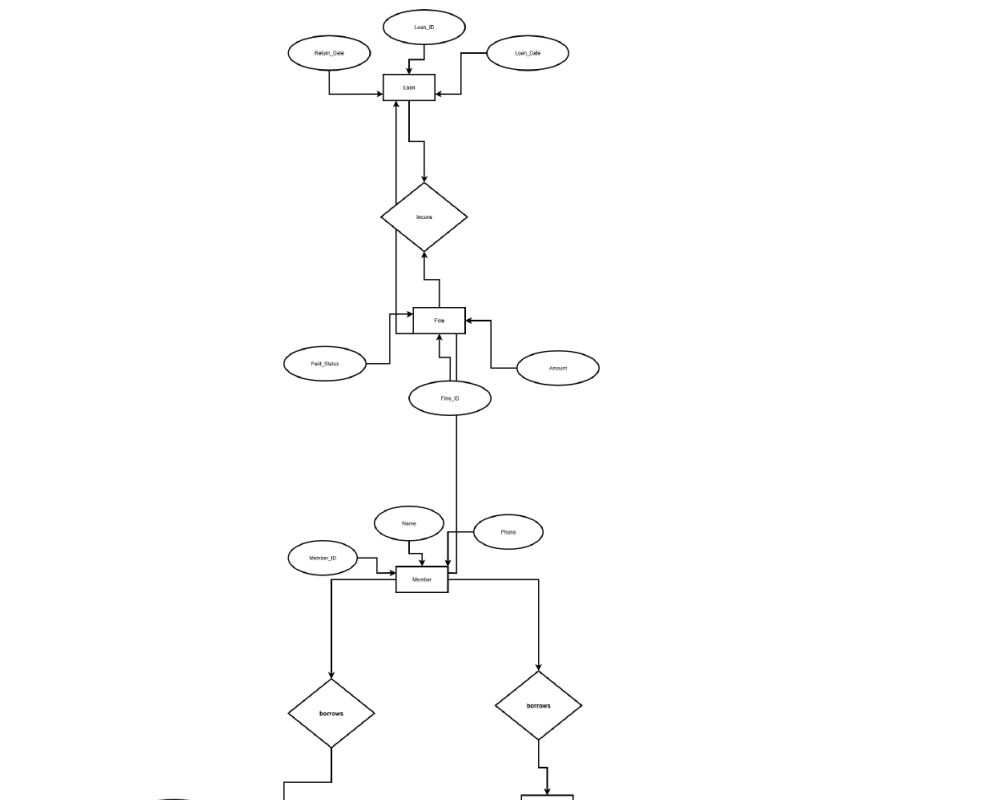
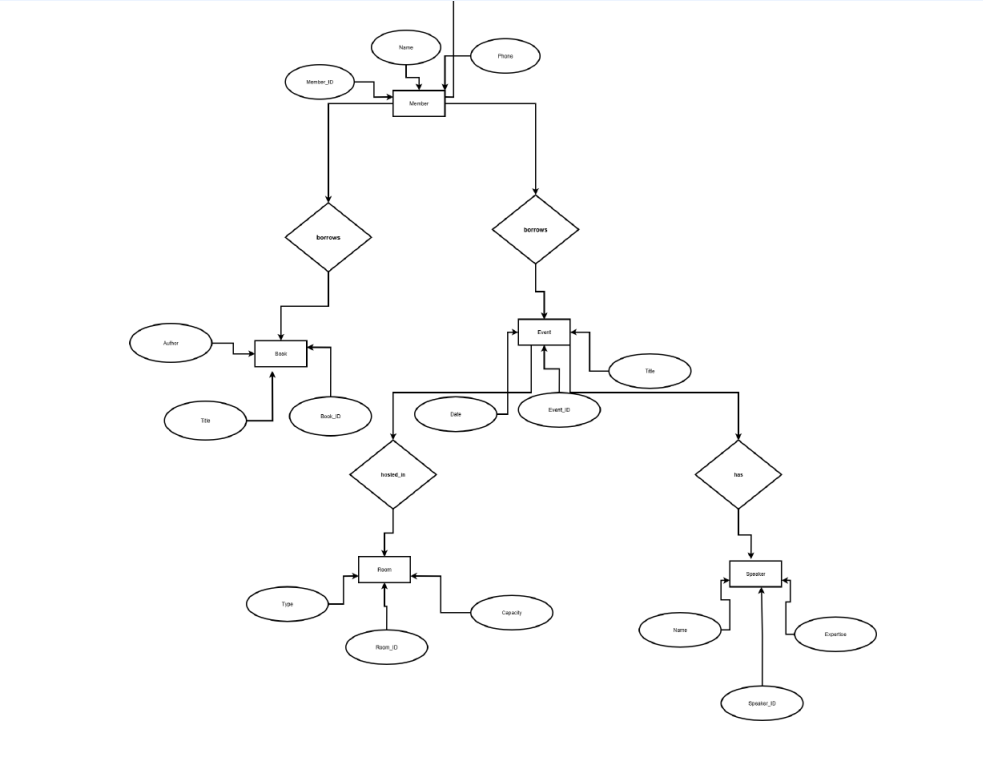

# Experiment 1: ER Diagram

## Scenario Chosen
**Library Management System**

## ER Diagram

## Entities and Attributes

### **Member**
- `Member_ID` *(Primary Key)*
- `Name`
- `Phone`

### **Book**
- `Book_ID` *(Primary Key)*
- `Title`
- `Author`

### **Loan**
- `Loan_ID` *(Primary Key)*
- `Loan_Date`
- `Return_Date`

### **Fine**
- `Fine_ID` *(Primary Key)*
- `Amount`
- `Paid_Status`

### **Room**
- `Room_ID` *(Primary Key)*
- `Type`
- `Capacity`

### **Event**
- `Event_ID` *(Primary Key)*
- `Title`
- `Date`

### **Speaker**
- `Speaker_ID` *(Primary Key)*
- `Name`
- `Expertise`

## 🔗 Relationships and Constraints

### **1. Borrows (Member → Book)**
- **Cardinality:** M:N  
- **Participation:** Partial  
- **Description:** A member can borrow multiple books, and each book can be borrowed by different members over time.

### **2. Loan (Book → Member)**
- **Cardinality:** 1:1 per loan record  
- **Participation:** Total from Loan side  
- **Description:** Each loan links a book to a member with details of issue and return dates.

### **3. Incurs (Loan → Fine)**
- **Cardinality:** 1:0..1  
- **Participation:** Optional  
- **Description:** Fines are applied only to overdue loans. Each fine is linked to one specific loan.

### **4. Organizes (Event → Room)**
- **Cardinality:** 1:1  
- **Participation:** Total from Event side  
- **Description:** Every event takes place in one room; a room can host many events at different times.

### **5. Has (Event → Speaker)**
- **Cardinality:** 1:M  
- **Participation:** Optional  
- **Description:** An event may feature one or more speakers.

### **6. Member Participates in Event**
- **Cardinality:** M:N  
- **Participation:** Optional  
- **Description:** Members can attend multiple events, and events can have multiple participating members.

## Design Choices

### **1. Separate Loan Entity**
To capture borrowing activities clearly, connecting Members and Books through a many-to-many relationship. Enables tracking of `Loan_Date` and `Return_Date`.

### **2. Fine Management**
Fines are modeled separately for flexibility in monitoring late returns, their amounts, and payment statuses.

### **3. Event Scheduling**
The Room entity manages library space allocation and ensures event capacity tracking and scheduling control.

### **4. Speaker Relationship**
Speakers are managed separately to allow guest lectures or workshops, expanding library engagement.

### **5. Comprehensive Member Role**
Members can borrow books and participate in events, reflecting both academic and community aspects of a library.

## Result
Thus, the **ER Diagram for the Library Management System** has been successfully designed to represent the core entities, attributes, and relationships required for efficient management of library operations including books, members, loans, fines, rooms, and events.
